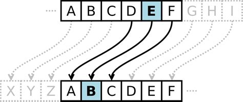

# Caesar Cipher

The **Caesar Cipher** is one of the simplest and oldest encryption techniques. It is a type of substitution cipher where each letter in the plaintext is shifted by a certain number of positions in the alphabet.

## How the Caesar Cipher Works



In the Caesar Cipher, each letter in the plaintext is replaced by a letter a fixed number of positions down or up the alphabet. For example, with a shift of `3`:
- `A` becomes `D`
- `B` becomes `E`
- `Z` wraps around to `C`

This technique can be applied to any text, using a given shift value (or key), and the result is the encrypted text (ciphertext). To decrypt, you simply reverse the process by shifting in the opposite direction.

### Formula for Encryption and Decryption

Given a **shift (key) `k`**, the formulas for encryption and decryption are:

#### Encryption Formula:
For a given letter `P` (plaintext letter) and key `k`, the corresponding ciphertext letter `C` is calculated as: 

```C = (P + k) % 26```

Where:
- `P` is the position of the plaintext letter in the alphabet (`A = 0`, `B = 1`, `C = 2`, ..., `Z = 25`)
- `k` is the key or shift value
- `% 26` ensures the result wraps around to the start of the alphabet if necessary (i.e., `Z` wraps to `A`).

#### Decryption Formula:
To decrypt a letter `C` (ciphertext letter) with the same key `k`, the original plaintext letter `P` is:

```P = (C - k) % 26```


### Example

Given a plaintext of **HELLO** and a shift of `3`:
- H → K
- E → H
- L → O
- L → O
- O → R

Then the encrypted message will be:  **KHOOR**.

To decrypt, shift `3` positions back, and you’ll recover the original text: **HELLO**.

## Implementation

### Encryption Formula:
To encrypt a letter, use the following formula:
